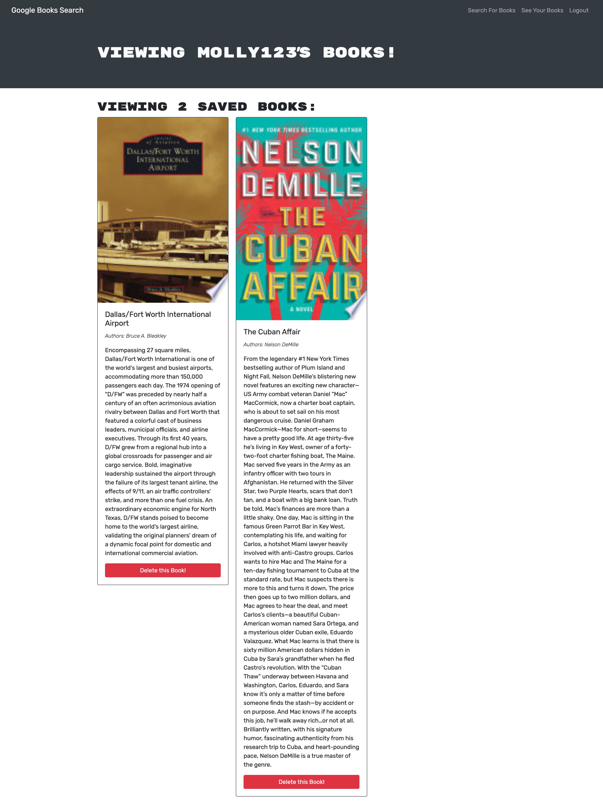

# DRR-21-Mern

## Description

With this project, I was given starter code with a fully functioning Google Books API search engine built with a RESTful API, and was tasked to refactor it to be a GraphQL API built with Apollo Server. The app was built using the MERN stack with a React front end, MongoDB database, and Node.js/Express.js server and API. Testing!

## Links

https://github.com/davidrestivo/DRR-21-Mern

https://dashboard.heroku.com/apps/sheltered-taiga-32497

## Instructions

Clone this repo. Install the dependencies. Go to terminal and type NPM run build. You might have to kill ports 3000 and 3001 by typing npx kill-port 3000 and/or 3001. Then type NPM run develop. This will run the app in your browser (preferably Chrome). Once signed in, browse for books to save them to your book repo. You can also delete books. Once your account is setup, you can log back in and see your book repo at any time.

## Screen shots

